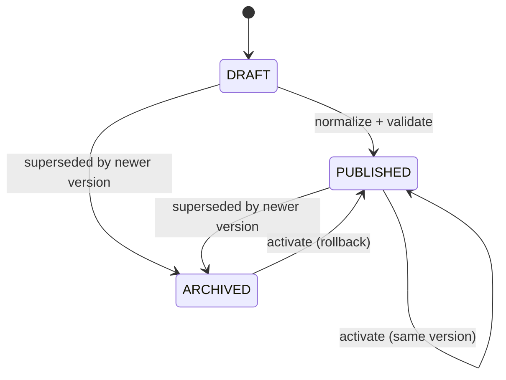

# 架构重构：分层决策 + 状态一致 + 约束驱动

**Date**: 2026-07-02
**Branch**: 0.0.3
**Status**: Draft

## 1. 背景与动机

当前系统经过多阶段功能迭代，暴露出以下结构性缺陷：

| 维度 | 问题 | 影响 |
|------|------|------|
| **知识上传** | .txt/.docx/.pdf 三种格式虽已支持，但解析策略单一——PDF 空文本或乱码时直接 fallback 到 OCR，无中间质量评估，LLM 收到空 input 产生无意义输出 | silent failure，管理员看不到问题 |
| **OCR → 结构化** | OCR 结果不经过结构化抽取层直接进入下游，schema 无强约束 | 字段缺失或默认值混入 policy_json，不被察觉 |
| **Policy 状态** | 5 种状态（draft/parsing/reviewing/published/archived）语义重叠，中间状态不可观测 | 无法准确判断系统处于哪一阶段 |
| **删除逻辑** | KB 删除未级联清理关联 PolicyVersion，也无依赖检测 | 孤立引用、残留数据、不可追溯 |
| **前端布局** | AdminView.vue 单文件包含 policy center、KB、stats、search debug，职责混合 | 维护成本高、调试工具进入生产用户视野 |
| **总体** | 功能堆叠优先于约束定义 | 系统复杂但不可靠，扩展困难 |

本次重构的核心目标是：**将约束先于功能**，确保数据一致性、状态可观测、边界不泄漏。

---

## 2. 总体架构原则

### 2.1 约束驱动（Constraint-Driven）

不追求"功能最多"，追求"功能有明确边界和契约"：

- 每条数据都有可追溯的生命周期
- 每个状态迁移都有明确的合法/非法规则
- 每个对外接口都有严格的输入校验和输出 schema
- 每次删除都有依赖引用检测，不做破坏历史一致性的操作

### 2.2 分层清晰

```
表现层（前端 View）       → 单一职责，业务域/系统域分离
├─ 路由层（Router）       → 子路由结构
├─ API 层（Backend API）  → RESTful，不做业务编排
├─ 服务层（Services）      → 业务逻辑编排 + 状态机守卫
├─ 基础设施层（Infra）    → ORM、LLM 客户端、存储
└─ 领域层（Domain）       → 纯业务对象，零外部依赖
```

### 2.3 可观测性优先

每个关键路径都要留下可追溯的证据：

- 每个文档上传 → 保留 raw_text、quality_score、处理链路
- 每个结构化抽取 → 保留 per-field confidence、source
- 每个状态迁移 → 保留 transition log

---

## 3. OCR → LLM 结构化抽取：分层决策管道

### 3.1 整体流程

不再是从 OCR 到 LLM 的线性路径，而是基于文本质量评估的三路分流：

```
                    ┌──────────────────────────────────┐
                    │        文件上传端点                │
                    │  POST /knowledge/bases/{id}/docs  │
                    └──────────┬───────────────────────┘
                               │
                    ┌──────────▼───────────────────────┐
                    │  文件类型校验                       │
                    │  仅允许: .txt / .docx / .pdf      │
                    │  其他 → 400 (UNSUPPORTED_FORMAT)  │
                    └──────────┬───────────────────────┘
                               │
                    ┌──────────▼───────────────────────┐
                    │  文本层提取（TextLayerExtractor）   │
                    │  - .txt  : 直接 io read            │
                    │  - .docx : python-docx             │
                    │  - .pdf  : pdfplumber              │
                    └──────────┬───────────────────────┘
                               │
                    ┌──────────▼───────────────────────┐
                    │  文本质量评估（TextQualityAssessor）│
                    │  - char_count (有效字符数)         │
                    │  - garbled_ratio (乱码/控制符占比) │
                    │  - avg_line_length (平均行长度)    │
                    │  → Confidence Score [0.0, 1.0]   │
                    └──────────┬───────────────────────┘
                               │
           ┌───────────────────┼────────────────────┐
           │  score ≥ 0.7     │ 0.3 < score < 0.7 │ score ≤ 0.3
           ▼                   ▼                    ▼
  ┌──────────────────┐  ┌──────────────┐  ┌──────────────────┐
  │ Direct LLM       │  │ OCR + Merge  │  │ Force OCR         │
  │ Structured       │  │ (combine both│  │ (PaddleOCR)       │
  │ Extraction       │  │  text layers)│  │ - 高质量图-文提取   │
  └────────┬─────────┘  └──────┬───────┘  └────────┬─────────┘
           │                   │                    │
           └───────────────────┼────────────────────┘
                               │
                    ┌──────────▼───────────────────────┐
                    │  LLM 结构化抽取（StructuredExtractor）│
                    │  - 统一入口，所有文档必经之路         │
                    │  - LLM 调用 DeepSeek 按 JSON schema │
                    │    强约束生成                       │
                    │  - 允许 partial 字段 + per-field    │
                    │    confidence + source 标记         │
                    │  - 禁止无结构输出 / fallback 默认值  │
                    │    检查点：response 必须符合 schema  │
                    └──────────┬───────────────────────┘
                               │
                    ┌──────────▼───────────────────────┐
                    │  输出: StructuredExtractionResult  │
                    │  - requires_review 标记            │
                    │  - overall_confidence              │
                    │  - per-field warnings              │
                    └──────────┬───────────────────────┘
                               │
                    ┌──────────▼───────────────────────┐
                    │  写入 knowledge_documents (DB)    │
                    │  存储 raw_text + extraction JSON  │
                    │  + 质量元数据                      │
                    └──────────────────────────────────┘
```

### 3.2 文本质量评估（TextQualityAssessor）

```python
@dataclass
class QualityAssessment:
    confidence: float           # [0.0, 1.0]
    char_count: int
    garbled_ratio: float
    avg_line_length: float
    has_text_layer: bool
    recommendation: str         # "direct_llm" | "ocr_merge" | "force_ocr"

class TextQualityAssessor:
    GARBLED_PATTERN = re.compile(r'[^\x20-\x7E一-鿿　-〿＀-￯\n\r\t]')

    def assess(self, text: str) -> QualityAssessment:
        char_count = len(text.strip())
        garbled_chars = len(self.GARBLED_PATTERN.findall(text))
        garbled_ratio = garbled_chars / max(char_count, 1)
        lines = [l for l in text.split('\n') if l.strip()]
        avg_line_length = sum(len(l) for l in lines) / max(len(lines), 1)

        if char_count > 50 and garbled_ratio < 0.15:
            return QualityAssessment(
                confidence=min(1.0, char_count / 500 * (1 - garbled_ratio)),
                char_count=char_count,
                garbled_ratio=garbled_ratio,
                avg_line_length=avg_line_length,
                has_text_layer=True,
                recommendation="direct_llm",
            )
        elif char_count > 50 and garbled_ratio < 0.3:
            return QualityAssessment(
                confidence=0.5,
                char_count=char_count,
                garbled_ratio=garbled_ratio,
                avg_line_length=avg_line_length,
                has_text_layer=True,
                recommendation="ocr_merge",
            )
        else:
            return QualityAssessment(
                confidence=0.0,
                char_count=char_count,
                garbled_ratio=garbled_ratio,
                avg_line_length=avg_line_length,
                has_text_layer=char_count > 0,
                recommendation="force_ocr",
            )
```

### 3.3 LLM 结构化抽取（StructuredExtractor）

**统一入口**：所有文档上传最终都要经过此模块。禁止跳过。

**Schema 强约束**：LLM Prompt 中附带严格 JSON Schema，要求 DeepSeek 按 `function_call` 模式返回结构化数据（而非自由文本）。

**输出格式**：

```python
# schemas/extraction.py

from pydantic import BaseModel
from typing import Any, Literal
from enum import Enum

class ExtractionSource(str, Enum):
    TEXT = "text"           # 从文本中直接提取
    OCR = "ocr"             # 从 OCR 结果中提取
    AI_INFERENCE = "ai_inference"  # LLM 推理得出
    MISSING = "missing"     # 未能提取

class FieldExtraction(BaseModel):
    """单字段提取结果，允许 partial"""
    value: Any = None
    confidence: float       # [0.0, 1.0]
    source: ExtractionSource

class StructuredExtractionResult(BaseModel):
    """完整文档的抽取结果"""
    fields: dict[str, FieldExtraction]
    overall_confidence: float     # 加权平均
    requires_review: bool         # overall_confidence < 0.6
    raw_text_snippet: str         # 前 500 字符（调试用）
    warnings: list[str]

# 预定义 Expense Policy Schema（示例字段）
EXPENSE_POLICY_SCHEMA = {
    "type": "object",
    "properties": {
        "max_amount": {
            "type": "number",
            "description": "单次最大可报销金额（元）",
        },
        "reimbursement_ratio": {
            "type": "number",
            "description": "报销比例（0-1）",
            "minimum": 0,
            "maximum": 1,
        },
        "requires_receipt": {
            "type": "boolean",
            "description": "是否需要发票",
        },
        "requires_approval": {
            "type": "boolean",
            "description": "是否需要审批",
        },
        "approval_threshold": {
            "type": "number",
            "description": "超过此金额需审批（元）",
        },
        "max_count_per_month": {
            "type": "integer",
            "description": "每月最大报销次数",
        },
        "eligible_categories": {
            "type": "array",
            "items": {"type": "string"},
            "description": "适用费用类别列表",
        },
    },
    "required": ["max_amount", "reimbursement_ratio"],
}
```

**不可绕过检查点**：

```python
class StructuredExtractor:
    def extract(self, text: str, schema: dict) -> StructuredExtractionResult:
        attempt = self._call_llm(text, schema)
        # 不可绕过检查：response 必须符合 schema
        if not self._validate_against_schema(attempt, schema):
            # 重试一次，再不通过则标记 requires_review
            attempt = self._call_llm(text, schema, retry=True)
        if not self._validate_against_schema(attempt, schema):
            return StructuredExtractionResult(
                fields={},
                overall_confidence=0.0,
                requires_review=True,
                raw_text_snippet=text[:500],
                warnings=["LLM 输出不符合 schema，需人工干预"],
            )
        return attempt
```

### 3.4 文件上传端点变更

`POST /knowledge/bases/{kb_id}/documents` 返回结构增强：

```python
# 当前返回:
class KnowledgeDocumentResponse(BaseModel):
    id: int
    filename: str
    content: str          # 纯文本
    chunk_count: int

# 增强后:
class KnowledgeDocumentResponse(BaseModel):
    id: int
    filename: str
    chunk_count: int
    extraction: StructuredExtractionResult  # 结构化抽取结果
    upload_metadata: {
        text_quality: QualityAssessment,    # 文本质量评估
        processing_chain: str,              # "direct_llm" | "ocr_merge" | "force_ocr"
    }
```

---

## 4. Policy 状态机：最小可控状态 + 版本激活

### 4.1 状态收敛

从 5 状态 → 3 状态 + 内部子状态：



```python
# domain/enums.py
class PolicyStatus(str, enum.Enum):
    DRAFT = "draft"
    PUBLISHED = "published"
    ARCHIVED = "archived"

# 子状态（内部跟踪，不暴露到状态机）
SUB_STATUS_DRAFTING = "drafting"     # 刚创建，无 AI draft
SUB_STATUS_PARSING = "parsing"       # AI 解析中
SUB_STATUS_REVIEWING = "reviewing"   # 人工审查中
SUB_STATUS_READY = "ready"           # 可发布
```

**子状态跟踪方式**：`PolicyVersion.sub_status` 字段（`str`，nullable），仅用于前端 UI 显示进度，**不参与状态迁移规则**。

### 4.2 强制迁移规则

```python
# domain/enums.py
VALID_POLICY_TRANSITIONS: dict[PolicyStatus, set[PolicyStatus]] = {
    PolicyStatus.DRAFT: {PolicyStatus.PUBLISHED, PolicyStatus.ARCHIVED},
    PolicyStatus.PUBLISHED: {PolicyStatus.ARCHIVED},
    PolicyStatus.ARCHIVED: {PolicyStatus.PUBLISHED},   # 唯一回退路径
}
```

所有跨状态变更必须通过守卫函数：

```python
def assert_transition_allowed(current: PolicyStatus, target: PolicyStatus) -> None:
    if target not in VALID_POLICY_TRANSITIONS.get(current, set()):
        raise InvalidPolicyTransition(
            f"Cannot transition from {current} to {target}. "
            f"Allowed: {VALID_POLICY_TRANSITIONS.get(current, set())}"
        )
```

### 4.3 版本激活（取代 unpublish / rollback）

两个独立操作（unpublish / rollback）统一为一个原子操作：

```python
def activate_version(policy_id: str, version_id: str) -> VersionActivationResult:
    """
    将指定版本激活为当前 Published 版本。

    行为（取决于目标版本当前状态）：
    - DRAFT     → 检查 policy_json 是否完整 → PUBLISHED
    - ARCHIVED  → 重新激活（rollback）→ PUBLISHED
    - PUBLISHED → no-op（已是 active）

    副作用：
    - 之前 active 的版本（如有）→ ARCHIVED
    - 更新 Policy.current_version_id
    - 写 StatusTransition 记录
    """
```

**为什么统一**：
- unpublish（published → draft/reviewing）在系统中没有意义——发布后发现不对应回滚到某个历史版本，而非退回到审查阶段
- rollback 是激活一个已归档的历史版本
- 两者本质都是"切换 active version"
- 统一后状态迁移图更清晰：只有 PUBLISHED <-> ARCHIVED 之间的双向路径

### 4.4 可追溯性

每次状态变更写 `StatusTransition`：

```python
class StatusTransition(Base):
    __tablename__ = "status_transitions"

    id = Column(Integer, primary_key=True)
    entity_type = Column(String, nullable=False)  # "policy" | "policy_version"
    entity_id = Column(String, nullable=False)
    from_status = Column(String, nullable=True)
    to_status = Column(String, nullable=False)
    triggered_by = Column(String, nullable=False)  # "user_activate" | "user_publish" | "system_supersede"
    actor_id = Column(Integer, ForeignKey("users.id"))
    metadata_json = Column(JSON, nullable=True)
    created_at = Column(DateTime, default=func.now())
```

---

## 5. KB 删除：软删除 + 依赖引用检测

### 5.1 决策

| 方案 | 结论 | 理由 |
|------|------|------|
| 级联删除 PolicyVersion | **否决** | 破坏历史一致性，生产环境不可恢复 |
| 仅解绑 + 软删除 KB | **采纳** | 保留 PolicyVersion 数据完整性 |
| 阻止删除（依赖检测） | **采纳** | 已发布的 PolicyVersion 所属 KB 不可删除 |

### 5.2 实现

```python
# services/knowledge_service.py

@dataclass
class SoftDeleteKBResult:
    success: bool
    reason: str = ""
    linked_published_versions: list[int] = field(default_factory=list)

def soft_delete_kb(db: Session, kb_id: int) -> SoftDeleteKBResult:
    kb = db.query(KnowledgeBase).filter(KnowledgeBase.id == kb_id).first()
    if not kb:
        return SoftDeleteKBResult(success=False, reason="KB not found")

    # 依赖检测
    published_versions = (
        db.query(PolicyVersion)
        .filter(
            PolicyVersion.kb_id == kb_id,
            PolicyVersion.status == PolicyStatus.PUBLISHED,
        )
        .all()
    )
    if published_versions:
        return SoftDeleteKBResult(
            success=False,
            reason=f"KB #{kb_id} 关联了 {len(published_versions)} 个已发布版本，不可删除",
            linked_published_versions=[v.id for v in published_versions],
        )

    # 解绑未发布的 PolicyVersion（UNSET kb_id）
    orphaned_versions = (
        db.query(PolicyVersion)
        .filter(PolicyVersion.kb_id == kb_id)
        .all()
    )
    for v in orphaned_versions:
        v.kb_id = None
        v.kb_link_status = "orphaned"  # 新增字段，标记孤岛状态

    # 软删除 KB 本身
    kb.is_active = False
    kb.deactivated_at = func.now()

    return SoftDeleteKBResult(success=True)
```

### 5.3 DB Schema 变更

`knowledge_bases` 表：

| 字段 | 变更 |
|------|------|
| `is_active` | 已有，无需变更 |
| `deactivated_at` | **新增** `DateTime, nullable` |

`policy_versions` 表：

| 字段 | 变更 |
|------|------|
| `kb_link_status` | **新增** `str, nullable`，可选值: `"active"`, `"orphaned"`，默认为 `"active"` |

API 返回变更：

```python
# DELETE /knowledge/bases/{kb_id}
# 成功响应 200
{
    "success": True,
    "message": "KB #3 已软删除",
    "deactivated_at": "2026-07-02T10:00:00Z"
}

# 依赖冲突响应 409
{
    "detail": {
        "code": "KB_HAS_PUBLISHED_VERSIONS",
        "message": "KB #3 关联了 2 个已发布版本",
        "linked_version_ids": [5, 7]
    }
}
```

---

## 6. 前端：业务域 / 系统域拆分

### 6.1 路由结构

```
/admin                          → AdminLayout.vue (shell)
├── /admin                      → 默认 redirect → /admin/knowledge
├── /admin/knowledge            → KnowledgeView.vue       [业务域]
├── /admin/policy               → PolicyView.vue          [业务域]
├── /admin/analytics            → AnalyticsView.vue       [系统域]
├── /admin/debug                → DevDebugView.vue        [系统域，DEV ONLY]
└── /admin/*                    → 404
```

### 6.2 域可见性规则

```typescript
// router/index.ts
const devMode = import.meta.env.DEV || new URLSearchParams(window.location.search).has('dev')

const routes = [
  {
    path: '/admin',
    component: AdminLayout,
    children: [
      { path: '', redirect: '/admin/knowledge' },
      { path: 'knowledge', component: () => import('@/views/admin/KnowledgeView.vue') },
      { path: 'policy', component: () => import('@/views/admin/PolicyView.vue') },
      { path: 'analytics', component: () => import('@/views/admin/AnalyticsView.vue') },
      // DevDebugView 仅在 dev mode 下加载
      ...(devMode
        ? [{ path: 'debug', component: () => import('@/views/admin/DevDebugView.vue') }]
        : []),
    ],
  },
]
```

### 6.3 AdminLayout.vue（Shell）

纯布局组件，不做任何业务逻辑：

```vue
<template>
  <div class="admin-layout">
    <aside class="sidebar">
      <div class="brand">Expense AI Admin</div>
      <nav>
        <router-link to="/admin/knowledge">📚 知识库</router-link>
        <router-link to="/admin/policy">📋 政策中心</router-link>
        <router-link to="/admin/analytics">📊 统计</router-link>
        <router-link v-if="showDebug" to="/admin/debug">🔧 调试</router-link>
      </nav>
      <div class="sidebar-footer">
        <router-link to="/chat">← 返回聊天</router-link>
      </div>
    </aside>
    <main class="content">
      <router-view />
    </main>
  </div>
</template>
```

### 6.4 各 View 职责

| View | 数据源 | 操作 |
|------|--------|------|
| **KnowledgeView** | `GET /knowledge/bases` + `/documents` + `/search` | 创建 KB、上传文档、展开 chunks、搜索测试 |
| **PolicyView** | `GET /policy/list` + `/versions` + `/draft` | 上传 PDF、编辑 draft、normalize、publish、版本列表、版本激活 |
| **AnalyticsView** | `GET /admin/stats` 等 | 统计图表、状态分布、概览卡片 |
| **DevDebugView** | `GET /knowledge/chroma-stats` + `/chroma-search-raw` | ChromaDB 直接查询、向量搜索参数调优、raw response 展示 |

### 6.5 迁移路径

1. 创建 `AdminLayout.vue`（纯 shell）
2. 从 `AdminView.vue` 提取 KB 相关逻辑 → `KnowledgeView.vue`
3. 从 `AdminView.vue` 提取 Policy 相关逻辑 → 填充 `PolicyView.vue`（已有骨架）
4. 从 `AdminView.vue` 提取统计相关 → `AnalyticsView.vue`
5. 从 `AdminView.vue` 提取 Debug 面板 → `DevDebugView.vue`
6. 更新 router 配置
7. 删除 `AdminView.vue`（或保留为兼容重定向）

---

## 7. DB Schema 变更总览

### 7.1 新增字段

| 表 | 字段 | 类型 | 说明 |
|----|------|------|------|
| `knowledge_bases` | `deactivated_at` | `DateTime, nullable` | 软删除时间戳 |
| `policy_versions` | `kb_link_status` | `String(20), nullable` | 可选值: "active" / "orphaned" |
| `policy_versions` | `sub_status` | `String(20), nullable` | 内部子状态: drafting/parsing/reviewing/ready |

### 7.2 新增表

`policy_transitions`（专用于 policy 状态变更，不影响现有报销 `status_transitions`）：

| 字段 | 类型 | 说明 |
|------|------|------|
| `id` | Integer PK | |
| `entity_type` | String | "policy" / "policy_version" |
| `entity_id` | String | |
| `from_status` | String, nullable | |
| `to_status` | String | |
| `triggered_by` | String | "user_publish" / "user_activate" / "system_supersede" |
| `actor_id` | Integer FK → users.id | 操作人 |
| `metadata_json` | JSON, nullable | 额外元数据 |
| `created_at` | DateTime | |

---

## 8. 文件变更清单

### 8.1 新增文件

| 路径 | 说明 |
|------|------|
| `backend/app/services/text_quality_assessor.py` | 文本质量评估 |
| `backend/app/services/structured_extractor.py` | LLM 结构化抽取（统一入口） |
| `backend/app/schemas/extraction.py` | StructuredExtractionResult, FieldExtraction 等 schema |
| `frontend/src/views/admin/AdminLayout.vue` | Admin shell 布局 |
| `frontend/src/views/admin/KnowledgeView.vue` | 知识库管理页 |
| `frontend/src/views/admin/AnalyticsView.vue` | 统计页 |
| `frontend/src/views/admin/DevDebugView.vue` | 调试页（dev only） |

### 8.2 修改文件

| 路径 | 变更内容 |
|------|----------|
| `backend/app/domain/enums.py` | PolicyStatus 简化为 3 值 + 子状态常量 + VALID_POLICY_TRANSITIONS |
| `backend/app/api/knowledge.py` | 删除端点改为软删除 + 依赖检测；上传返回增强 |
| `backend/app/services/knowledge_service.py` | 新增 `soft_delete_kb()` |
| `backend/app/services/policy_publisher.py` | 新增 `activate_version()` 替代 unpublish/rollback |
| `backend/app/services/policy_service.py` | 版本激活逻辑；状态迁移守卫 |
| `backend/app/infrastructure/orm.py` | 新增字段 + `StatusTransition` 表扩展 |
| `backend/app/api/policy.py` | 新增 `POST /policy/{id}/versions/{id}/activate` |
| `backend/frontend/src/views/admin/PolicyView.vue` | 填充已有骨架，新增版本激活 UI |
| `backend/frontend/src/router/index.ts` | 4 个子路由 + dev-only debug route |
| `backend/app/services/ocr_service.py` | 输出接入 StructuredExtractor |

### 8.3 删除/归档文件

| 路径 | 说明 |
|------|------|
| `frontend/src/views/AdminView.vue` | 删除，内容已分散到各子 view |

---

## 9. 不做的（Scope Exclusions）

| 事项 | 原因 |
|------|------|
| 修改 ChatView.vue 或聊天相关逻辑 | 不在本次重构范围 |
| 重写 ReAct Agent（agent_service.py） | 现有 Agent 架构满足需求 |
| 修改 DeepSeek 之外的 LLM provider | 非必要性变更 |
| 数据库迁移工具（alembic）接入 | 项目当前使用 SQLite + 直接 schema 同步，不引入额外依赖 |
| 前端主题/UI 重新设计 | 纯架构拆分，不涉及视觉改版 |
| 测试覆盖率提升 | 本次重点是结构性变更，测试随功能变更同步更新 |

---

## 10. 迁移策略

为避免大爆炸式发布，分为 4 个可独立验证的阶段：

### Phase A: 后端管道重构（可独立测试）

1. TextQualityAssessor + StructuredExtractor 实现 + 测试
2. OCR service 输出接入 StructuredExtractor
3. 文件上传端点返回增强
4. 验证：上传不同质量文档，确认处理结果正确

### Phase B: 状态机 + 版本激活（不影响已有数据）

1. PolicyStatus 枚举简化
2. `activate_version()` 实现
3. 状态迁移守卫 + StatusTransition 记录
4. 验证：旧数据（archived）可被正常 activate；非法迁移被阻止

### Phase C: 软删除 + 前端拆分（同时部署）

1. KB 软删除 + 依赖检测
2. AdminLayout.vue + 4 个子 View
3. Router 更新
4. 验证：所有页面可导航、功能正常

### Phase D: 清理

1. 删除旧 AdminView.vue
2. 确认无残留引用

---

## 11. 风险评估

| 风险 | 概率 | 影响 | 缓解措施 |
|------|------|------|---------|
| 旧数据中 policy_versions.status 为 parsing/reviewing，状态简化后不匹配 | 中 | 中 | 迁移脚本：将现有 parsing → draft, reviewing → draft |
| KB 软删除后搜索遗漏 | 低 | 中 | 搜索时显式过滤 `is_active == true` |
| 前端拆分时遗漏功能 | 低 | 高 | 逐功能对照旧 AdminView 清单迁移；迁移后并行运行两版对比 |
| StructuredExtractor 成为 LLM API 调用瓶颈 | 低 | 低 | 调用设置超时（30s）；失败时标记 requires_review，不阻塞调用链 |
